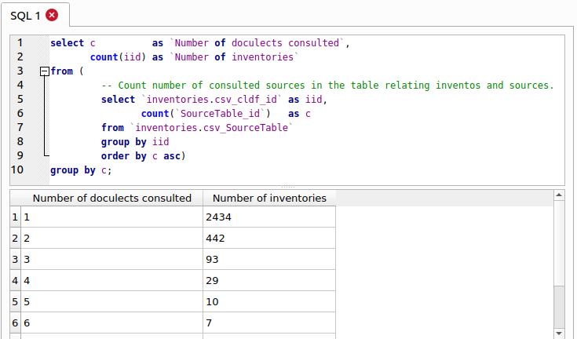

# Frequently Asked Questions

## Introduction

This FAQ answers questions regarding the editorial principles and design decisions 
that went into the creation of PHOIBLE. We appreciate and welcome feedback regarding 
these FAQs via [our issue tracker](https://github.com/phoible/dev/issues) or by 
contacting the editors directly.

You can get releases of PHOIBLE from [Zenodo](https://doi.org/10.5281/zenodo.2562766)
or from the [release page](https://github.com/cldf-datasets/phoible/releases).
While the CLDF data in these releases can easily be read and analyzed by tools like R - or
even just spreadsheet programs, in the remainder of this FAQ we will make use of the
fact that each CLDF dataset can be converted to a SQLite database and queried using
SQL.

To prepare an SQLite database with the PHOIBLE data, you will need 
- the [pycldf](https://pypi.org/project/pycldf/) Python package 
- an unzipped download of a PHOIBLE release.

Then you can run the `cldf createdb` command, which was installed with `pycldf`:
```shell
cldf createdb PATH/TO/DOWNLOAD/cldf/StructureDataset-metadata.json phoible.sqlite
```
Now you can query the database using the [`sqlite3` program](https://sqlite.org/cli.html),
either interactively, typing SQL queries at the `sqlite> ` prompt, 
```shell
$ sqlite3 phoible.sqlite 
SQLite version 3.31.1 2020-01-27 19:55:54
Enter ".help" for usage hints.
sqlite> select count(*) from 'inventories.csv';
3020
```
or by having `sqlite3` read queries stored as SQL text files:
```shell
$ echo "select count(*) from 'inventories.csv';" > query.sql
$ sqlite3 phoible.sqlite < query.sql 
3020
```
You may also use the GUI program [DB Browser for SQLite](https://sqlitebrowser.org/) to follow
along.


## Inventories, language codes, doculects, and sources

<a nanme="how-are-phoible-inventories-created"></a>
### How are PHOIBLE inventories created?

For the most part, every phonological inventory in PHOIBLE is based on
one-and-only-one language description (usually a research article, book
chapter, dissertation, or descriptive grammar). The technical term for
this in comparative linguistics is “doculect” (from “documented lect”),
in which [lect](https://en.wikipedia.org/wiki/Variety_(linguistics))
means a specific form of a language or dialect, i.e. an instance of
documentation of an instance of linguistic behavior at a particular time
and place (Cysouw &amp; Good, 2013). A brief explanation and some history of
why linguists use the term “doculect,” which has gained broad acceptance
in light of the issues of language identification and the use of
“language codes,” is given in [this blog post](https://dlc.hypotheses.org/623)
by Michael Cysouw.

Contributors to PHOIBLE start with a doculect, extract the contrastive
phonemes and allophones, and (if necessary) adapt the authors’ choice of
symbols to align with PHOIBLE’s [symbol guidelines](conventions.md). If 
the authors have
not provided ISO 639-3 and Glottolog codes, these are determined before
adding the inventory to PHOIBLE. Each inventory is then given a unique
numeric ID. Doculects are tracked in PHOIBLE using BibTeX keys.


### Why do some phonological inventories combine more than one doculect?

An exception to the “one doculect per inventory” rule arises for inventories that 
were originally part of a curated phonological database such as UPSID (Maddieson, 1984; 
Maddieson & Precoda, 1990) or SPA (Crothers, Lorentz, Sherman, & Vihman, 1979). In 
those collections, inventories were often based on multiple descriptions of linguistic 
behavior, written by different linguists; those descriptions were believed to be 
describing the same language, and disagreements between the descriptions were 
adjudicated by the experts who compiled the collection.

We can quickly see how many of PHOIBLE’s inventories are based on multiple doculects 
by looking at the mapping table between PHOIBLE inventories and sources:
```sql
select c          as `Number of doculects consulted`,
       count(iid) as `Number of inventories`
from (
         -- Count number of consulted sources in the table relating inventories and sources.
         select `inventories.csv_cldf_id` as iid,
                count(`SourceTable_id`)   as c
         from `inventories.csv_SourceTable`
         group by iid
         order by c asc)
group by c;
```

Number of doculects consulted|Number of inventories
--- | ---
1|2434
2|442
3|93
4|29
5|10
6|7
7|2
9|1
11|1

Running the query in DB Browser's "Execute SQL" pane, will look like this



Clearly, the majority of inventories in PHOIBLE represent a phonological description 
from a single doculect. But it seems strange that a single phonological inventory in 
PHOIBLE could be based on 11 different doculects. Let’s examine it:
```sql
select 
       l.cldf_glottocode    as `Glottocode`, 
       l.cldf_iso639p3code  as `ISO6393`, 
       l.cldf_name          as `LanguageName`, 
       s.cldf_id            as `Source`
from (select `inventories.csv_cldf_id` as iid, count(`SourceTable_id`) as c
      from `inventories.csv_SourceTable`
      group by `inventories.csv_cldf_id`) as q,
     ValueTable as v,
     LanguageTable as l,
     `inventories.csv` as i,
     `inventory_sources.csv` as s
where c = 11
  and iid = v.Inventory_ID
  and v.cldf_languageReference = l.cldf_id
  and i.cldf_id = iid
  and i.Inventory_source_ID = s.cldf_id limit 1;
```

Glottocode| ISO6393 | LanguageName | Source
--- | --- | --- | ---
haus1257|hau|Hausa|UPSID

As we can see, this inventory represents a description of
<a href="https://glottolog.org/resource/languoid/id/haus1257">Hausa</a> and was
added to PHOIBLE from the UPSID database (Maddieson, 1984; Maddieson &amp;
Precoda, 1990). To understand why this UPSID entry consulted 11
different sources, consider first that Hausa is typologically
interesting (e.g., it has both ejective and implosive phonation
mechanisms) and has tens of millions of speakers, making it relatively
well-studied (the <a href="https://glottolog.org/">Glottolog</a> reference catalog
has <a href="https://glottolog.org/resource/languoid/id/haus1257">more than 1400
references</a> related
to Hausa).

Second, note that Maddieson’s work on UPSID involved “typologizing”
phonological inventories from different doculects, so that they were
comparable across all entries in his database (cf. Hyman, 2008).
Maddieson’s work was groundbreaking at the time because he was the first
typologist to generate a stratified language sample aimed at being
genealogically balanced, i.e.&nbsp;for each language family he chose one
representative language. This allowed Maddieson to make statements about
the cross-linguistic distribution of contrastive speech sounds with some
level of statistical confidence. In fact, much about what we know about
the distribution of the sounds of the world’s languages is due to
Maddieson’s original language sample and his meticulous curation of the
data.


### Where do the language codes in PHOIBLE come from?

FIXME: complete!


### Missing isocodes

```sql
select i.cldf_id, l.cldf_glottocode, l.cldf_iso639p3code, l.cldf_name
from `inventories.csv` as i,
     ValueTable as v,
     LanguageTable as l
where v.Inventory_ID = i.cldf_id
  and v.cldf_languageReference = l.cldf_id
  and l.cldf_iso639p3code = 'mis'
group by i.cldf_id, l.cldf_glottocode, l.cldf_iso639p3code, l.cldf_name;
```

cldf_id|cldf_glottocode|cldf_iso639P3code|cldf_name
--- | --- | ---  | ---
2143|pisa1245|mis|Pisamira
2352|lizu1234|mis|Lizu
2388|east2773|mis|Eastern Newari
2420|zhon1235|mis|Zhongu
2434|vach1239|mis|Vach Khanty
2450|fore1274|mis|Forest Nenets
2691|mink1237|mis|Minkin
2714|guwa1244|mis|Guwar
2729||mis|Djindewal
2748|mith1236|mis|Mithaka
2773|cola1237|mis|Colac
2778|yari1243|mis|Yari-Yari
2782|west2443|mis|Western Victoria
2783|djad1246|mis|Djadjawurrungic
2792|kera1256|mis|Keramin
2793|lowe1402|mis|Lower Riverland
2794|ngin1247|mis|Ngindadj
2818|gudj1237|mis|Gudjal
2882|kawa1290|mis|Kawarrang-Ogh Undjan
2883|kawa1290|mis|Kawarrang-Ogh Undjan
2907|wala1263|mis|Walangama
2911|tyan1235|mis|Tyanngayt-Mamngayt-Ntrwangayt-Ntrangit
2913|luth1234|mis|Luthigh
2914|mbiy1238|mis|Mbiywom
2916|ngko1236|mis|Ngkoth
2920|yadh1237|mis|Yadhaykenu
2946|bula1255|mis|Bularnu
2956|yulp1239|mis|Yulparija
2988|west2443|mis|Western Victoria
2999|sout2770|mis|Southern Inland Yuin


```sql
select i.cldf_id, count(v.cldf_id), group_concat(v.cldf_value, ' ')
from `inventories.csv` as i,
     ValueTable as v,
     LanguageTable as l
where v.Inventory_ID = i.cldf_id
  and v.cldf_languageReference = l.cldf_id
  and l.cldf_iso639p3code = 'kbd'
group by i.cldf_id
order by cast(i.cldf_id as int);
```

cldf_id| c | phonemes
--- | --- | ---
4|56|b d̻ d̻z̻ f fʼ j kʷʰ kʷʼ k̟ʲʰ k̟ʲʼ m n̻ pʰ pʼ qχ qχʷ qχʷʼ qχʼ r s̻ t̻s̻ t̻s̻ʼ t̻ʰ t̻ʼ v w xʷ x̟ʲ z̻ ç̟ ħ ɡʷ ɡ̟ʲ ɣ̟ʲ ɦ ɬʲ ɬʲʼ ɮʲ ʁ ʁʷ ʃ ʃʼ ʒ ʔ ʔʷ ʕ ʝ̟ χ χʷ a̟ː e̞ː iː o̞ː uː ɜ ɨ
391|56|b d̪ d̪z̪ f fʼ j kʲʰ kʲʼ kʷʰ kʷʼ m n̪ pʰ pʼ qʷʼ qʼ qχ qχʷ r s̪ t̪s̪ t̪s̪ʼ t̪ʰ t̪ʼ v w xʲ xʷ z̪ ħ ɡʲ ɡʷ ɣʲ ɦ ɬ̪ʲ ɬ̪ʲʼ ɮ̪ʲ ʁ ʁʷ ʃ ʃʼ ʃ͇ ʒ ʒ͇ ʔ ʔʷ ʕ χ χʷ a̟ː e̞ː iː o̞ː uː ɜ ɨ
2310|55|b d dz d̠ʒ f fʼ j kʷ kʷʼ m n p pʼ q qʷ qʷʼ qʼ r s t ts tsʼ tʼ t̠ʃ t̠ʃʼ v w x xʷ z ħ ɡʷ ɣ ɬ ɬʼ ɮ ʁ ʁʷ ʃ ʆ ʆʼ ʒ ʓ ʔ ʔʷ χ χʷ ä e̞ː iː o̞ o̞ː uː ɑː ə
2401|63|b d dz dʑ f fʼ j kʷ kʷʼ kʼ l m n p pʼ q qʷ qʷʼ qʼ r s t ts tsʷʼ tsʼ tɕ tɕʼ tʷʼ tʼ t̠ʃ t̠ʃʼ v w x xʷ z zʷ ħ ɕ ɡʷ ɣ ɬ ɬʼ ʁ ʁʷ ʃ ʆ ʆʼ ʑ ʒ ʓ ʔ ʔʷ χ χʷ ä e̞ː iː o̞ o̞ː uː ɑː ə
2610|51|b d dz f fʼ h j kʲʼ kʷʰ kʷʼ l m n pʰ pʼ qʰ qʷʰ qʷʼ qʼ s ts tsʼ tʰ tʼ w xʷ z ç ħ ɡʲ ɡʷ ɬ ɬʼ ɾ ʁ ʁʷ ʃ ʃʼ ʒ ʔ ʔʷ ʝ χ χʷ äː eː iː oː uː ɐ ə


query.sql:
```sql
select cinvs, count(iso)
from (select l.cldf_iso639p3code as iso, count(distinct i.cldf_id) as cinvs
      from `inventories.csv` as i,
           ValueTable as v,
           LanguageTable as l
      where v.Inventory_ID = i.cldf_id
        and v.cldf_languageReference = l.cldf_id
      group by l.cldf_iso639p3code)
group by cinvs
order by cinvs desc;
```

https://github.com/mkaz/termgraph

```shell
$ sqlite3 -csv -separator "," phoible.sqlite < query.sql | termgraph

30: ▏ 1.00 
12: ▏ 1.00 
10: ▏ 1.00 
9 : ▏ 1.00 
8 : ▏ 3.00 
7 : ▏ 2.00 
6 : ▏ 7.00 
5 : ▏ 19.00
4 : ▇ 36.00
3 : ▇▇▇▇ 126.00
2 : ▇▇▇▇▇▇▇▇▇▇▇ 360.00
1 : ▇▇▇▇▇▇▇▇▇▇▇▇▇▇▇▇▇▇▇▇▇▇▇▇▇▇▇▇▇▇▇▇▇▇▇▇▇▇▇▇▇▇▇▇▇▇▇▇▇▇ 1542.00
```

```sql
select cinvs, count(gc)
from (select l.cldf_glottocode as gc, count(distinct i.cldf_id) as cinvs
      from `inventories.csv` as i,
           ValueTable as v,
           LanguageTable as l
      where v.Inventory_ID = i.cldf_id
        and v.cldf_languageReference = l.cldf_id
      group by l.cldf_glottocode)
group by cinvs
order by cinvs desc;
```

```shell
$ sqlite3 -csv -separator "," phoible.sqlite < query2.sql | termgraph

11: ▏ 1.00 
10: ▏ 1.00 
9 : ▏ 1.00 
8 : ▏ 2.00 
7 : ▏ 2.00 
6 : ▏ 4.00 
5 : ▏ 18.00
4 : ▇ 36.00
3 : ▇▇▇ 119.00
2 : ▇▇▇▇▇▇▇▇▇▇ 352.00
1 : ▇▇▇▇▇▇▇▇▇▇▇▇▇▇▇▇▇▇▇▇▇▇▇▇▇▇▇▇▇▇▇▇▇▇▇▇▇▇▇▇▇▇▇▇▇▇▇▇▇▇ 1640.00
```


```sql
select gc as `Glottocode`, names as `Names`, c as `Number of inventories`
from (
    select  gc, 
            group_concat(iname, ', ')   as names,
            count (iid)                 as c
    from (
        select distinct 
            l.cldf_glottocode   as gc, 
            i.cldf_name         as iname, 
            i.cldf_id           as iid 
        from 
            `inventories.csv`   as i, 
            ValueTable          as v, 
            LanguageTable       as l 
        where 
            v.Inventory_ID = i.cldf_id and 
            v.cldf_languageReference = l.cldf_id
    ) group by gc order by c desc)
where c > 5;
```

Glottocode|Names|Number of inventories
--- | --- | ---
osse1243|Ossetian, Iron Ossetic (Iron Ossetic (Tual-S)), Iron Ossetic (Iron Ossetic (Upper Alagir)), Iron Ossetic (Iron Ossetic (Tual-Ch)), Iron Ossetic (Iron Ossetic (Urs-Tual)), Iron Ossetic (Iron Ossetic (Roka)), Iron Ossetic (Iron Ossetic (Standard)), Iron Ossetic (Iron Ossetic (Alagir)), Iron Ossetic (Iron Ossetic (Ksani)), Iron Ossetic (Iron Ossetic (Tual-Sh)), Iron Ossetic (Iron Ossetic (Kurtat))|11
biri1256|Barna, Biri, Garingbal, Miyan, Wiri, Yambina, Yangga, Yilba, Yuwi, Wangan|10
stan1293|English, English (American) (Western and Mid-Western US; Southern California), American English (Southeastern Michigan), English (Australian), English (British) (Liverpool), English (New Zealand) (Pākehā), English (British) (Tyneside English (spoken in Newcastle)), English (English (RP)), English (English (Liverpool))|9
kham1282|Rgyalthang Tibetan, Brag-g.yab Tibetan, Nangchenpa Tibetan, Soghpo Tibetan, Kami Tibetan, Sangdam Tibetan, Dongwang Tibetan, Kham Tibetan|8
dutc1256|Dutch (Belgian Standard), Dutch (Belgian Standard Dutch), Dutch (the dialect of Hasselt (belongs to the West-Limburgian dialect group)), Dutch (the dialect of Maastricht (south-eastern dialect group; Central Limburgian)), Dutch (the Dutch dialect of Weert (West-Limburgian), rural variety (not Stadsweerts)), Dutch (the Belgian Limburg dialect of Hamont (belongs to the West Limburg dialects, subclassification: Dommellands)), Dutch (the Flemish-Brabant dialect of Orsmaal-gussenhoven), Dutch|8
east2328|Cheremis, MARI, Cheremis, Meadow Mari (Meadow Mari (Morki-Sernur)), Eastern Mari, Meadow Mari (Meadow Mari (Joškar-Ola)), Meadow Mari (Meadow Mari (Volga))|7
basq1248|Basque, BASQUE, Basque (Goizueta Basque), Basque (Basque (Baztan)), Basque (Basque (Arbizu)), Basque (Basque (Gernika)), Basque (Basque (Ondarroa))|7
lith1251|Lithuanian, LITHUANIAN, Lithuanian (Lithuanian (West Aukštaitian)), Lithuanian (Lithuanian (North Samogitian)), Lithuanian (Lithuanian (West Samogitian)), Lithuanian (Lithuanian (South Samogitian))|6
lazz1240|Laz, Laz (Laz (Borçka)), Laz (Laz (Pazar)), Laz (Laz (Ardeşen)), Laz (Laz (Hopa)), Laz (Laz (Arhavi))|6
khan1273|Ostyak, KHANTY, Eastern Khanty, Northern Khanty (Northern Khanty (Sob Obdorsk)), Northern Khanty (Northern Khanty (Polui Obdorsk)), Northern Khanty (Northern Khanty (Kazym))|6
gwan1268|Gwandara (Karshi) (Karshi), Gwandara (Cancara) (Cancara), Gwandara (Toni) (Toni), Gwandara (Gitata) (Gitata), Gwandara (Koro) (Koro), Gwandara (Nimbia) (Nimbia)|6

```sql
select src.cldf_id as `Source ID`, src.cldf_name as `Source name`, count(i.cldf_id) as `Number of inventories`
from `inventory_sources.csv` as src,
     `inventories.csv` as i
where i.Inventory_source_ID = src.cldf_id
group by src.cldf_id, src.cldf_name
order by `Number of inventories` desc;
```

Source ID|Source name|Number of inventories
--- | --- | ---
GM|Christopher Green and Steven Moran |460
UPSID|UCLA Phonological Segment Inventory Database|451
ER|Erich Round|392
EA|Dmitry Nikolaev|390
PH|Steven Moran and Daniel McCloy and Richard Wright.|389
SAPHON|South American Phonological Inventory Database|355
AA|Christian Chanard and Rhonda L. Hartell (AA)|203
SPA|Stanford Phonology Archive|197
RA|Ramaswami, N.|100
UZ|Steven Moran|83


```sql
select gc, c, names
from (select gc, count (srcid) as c, group_concat(srcid, ', ') as names from (select distinct l.cldf_glottocode as gc, i.Inventory_source_ID as srcid from `inventories.csv` as i, ValueTable as v, LanguageTable as l where v.Inventory_ID = i.cldf_id and v.cldf_languageReference = l.cldf_id) as q, `inventory_sources.csv` as src where src.cldf_id = q.srcid group by gc order by count (srcid) desc)
where c > 3;
```

gc|c|names
--- | --- | ---
khar1287|5|SPA, UPSID, PH, RA, EA
hind1269|5|SPA, UPSID, RA, UZ, EA
beng1280|5|SPA, UPSID, RA, UZ, EA
yuec1235|4|SPA, UPSID, UZ, EA
west2369|4|SPA, UPSID, UZ, EA
viet1252|4|SPA, UPSID, UZ, EA
telu1262|4|SPA, UPSID, RA, EA
taga1270|4|SPA, UPSID, GM, EA
tach1250|4|SPA, UPSID, GM, UZ
stan1295|4|SPA, UPSID, UZ, EA
stan1290|4|SPA, UPSID, UZ, EA
stan1288|4|SPA, UPSID, UZ, EA
nucl1417|4|SPA, UPSID, AA, UZ
nucl1310|4|SPA, UPSID, UZ, EA
nucl1302|4|SPA, UPSID, UZ, EA
nucl1301|4|SPA, UPSID, UZ, EA
nepa1254|4|UPSID, RA, UZ, EA
mund1320|4|SPA, UPSID, RA, EA
mode1248|4|SPA, UPSID, UZ, EA
mand1415|4|SPA, UPSID, PH, EA
kore1280|4|SPA, UPSID, UZ, EA
khan1273|4|SPA, UPSID, PH, EA
iris1253|4|SPA, UPSID, UZ, EA
hung1274|4|SPA, UPSID, UZ, EA
haus1257|4|SPA, UPSID, AA, UZ
hakk1236|4|SPA, UPSID, UZ, EA
east2328|4|SPA, UPSID, PH, EA
bulg1262|4|SPA, UPSID, UZ, EA
basq1248|4|SPA, UPSID, UZ, EA
akan1250|4|SPA, UPSID, AA, GM


```sql
select ma, count(iso)
from (select distinct l.cldf_macroarea as ma, l.cldf_iso639p3code as iso
      from languagetable as l,
           valuetable as v
      where v.cldf_languageReference = l.cldf_id)
group by ma
order by ma;
```

ma|count(iso)
--- | ---
|1
Africa|709
Australia|292
Eurasia|439
North America|144
Papunesia|183
South America|334

```sql
select ma, count(iid)
from (select distinct l.cldf_macroarea as ma, i.cldf_id as iid
      from languagetable as l,
           valuetable as v,
           `inventories.csv` as i
      where v.cldf_languageReference = l.cldf_id
        and v.Inventory_ID = i.cldf_id)
group by ma
order by ma;
```

ma|count(iid)
--- | ---
|1
Africa|887
Australia|436
Eurasia|816
North America|184
Papunesia|217
South America|479


```shell
$ sqlite3 -csv -separator "," phoible.sqlite "select cldf_glottocode, cldf_latitude, cldf_longitude from LanguageTable" | glottolog --repos PATH/TO/glottolog/glottolog --repos-version v4.3 htmlmap --open
```
